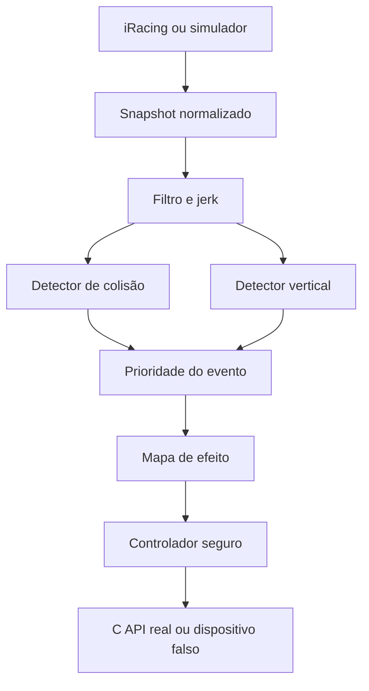
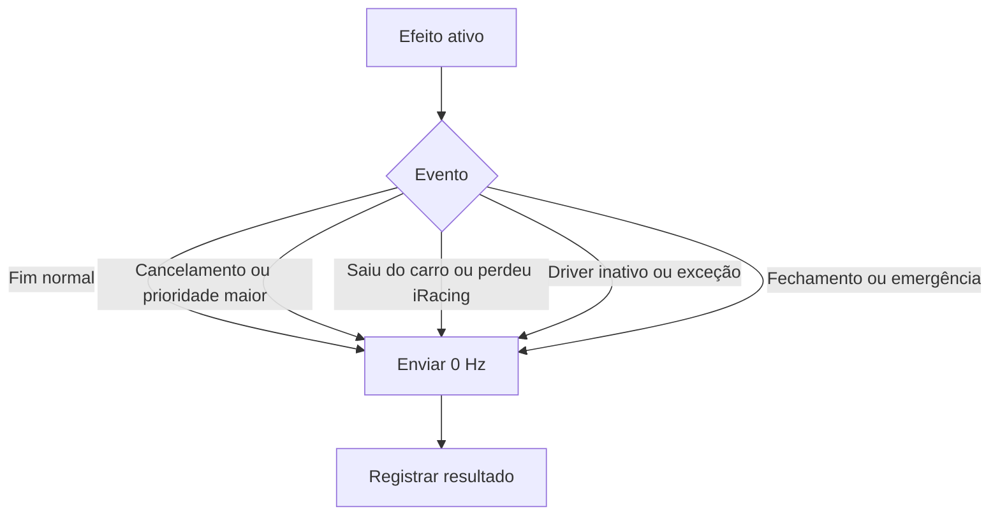

# Arquitetura

## Camadas

### Core

- `TelemetrySignalProcessor`: EMA rápida/lenta, diferenças, jerk e contexto;
- `ImpactDetector`: colisões, direção, severidade, capotamento;
- `VerticalImpactDetector`: zebra, queda, pouso e compressão;
- `HapticDetectionPipeline`: executa os dois detectores e escolhe prioridade;
- `RumbleEffectMapper`: evento para pulsos;
- `RumbleController`: serialização, preempção, cancelamento, limites e OFF;
- `SettingsService`, `ProfileCatalog`, `RotatingFileLogger`;
- `TelemetryRecorder`, `TelemetryReplayClient`, `CalibrationAnalyzer`;
- `TelemetrySimulator` e `SimulatedRumbleDevice`.

### Infrastructure

- `Psvr2ToolkitClient`: descoberta/carregamento/exports/estado/chamadas;
- `IRacingSharedMemoryClient`: memória compartilhada, reconexão e normalização.

### App

- `AppCoordinator`: ciclo de vida e integração sem lógica de detector na UI;
- `MainForm`: interface WinForms PT-BR.

## Fluxo

## Falhas e OFF

Um timeout nativo é especial: o thread gerenciado não pode encerrar com
segurança uma função C que travou. Nesse caso o cliente bloqueia novos comandos
e mantém a DLL carregada até o processo terminar, evitando descarregá-la sob
uma função potencialmente ativa.

## Extensões futuras

`AppSettings` separa perfil, detectores, efeitos e segurança. A próxima versão
pode associar um perfil a metadados de sessão/car/pista sem alterar detectores
ou controlador. Novos dispositivos implementam `IHmdRumbleDevice`; novas
fontes implementam `ITelemetryClient`.
