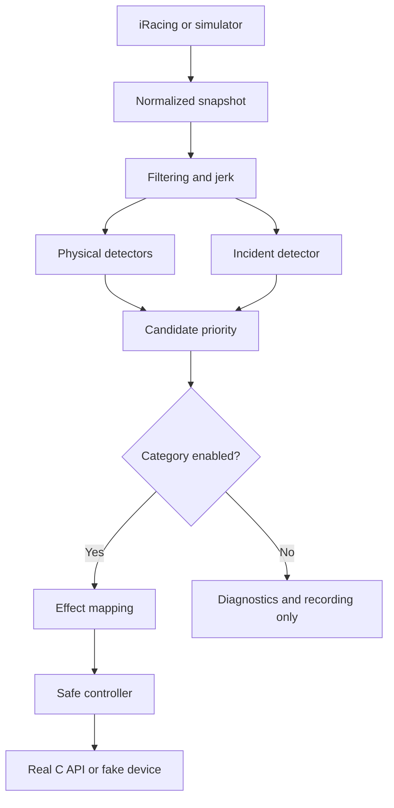
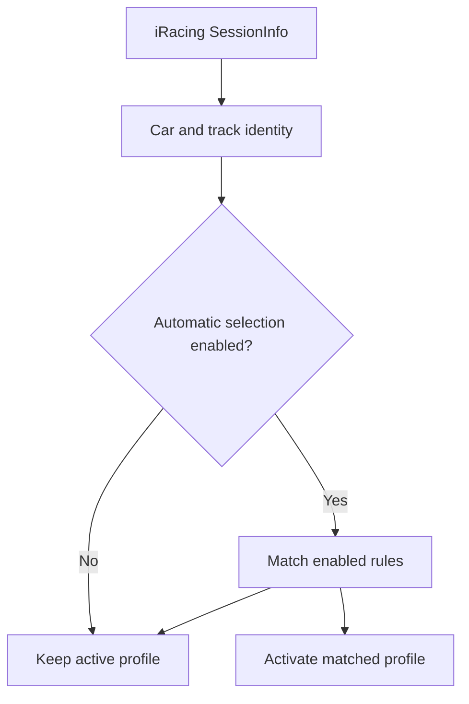
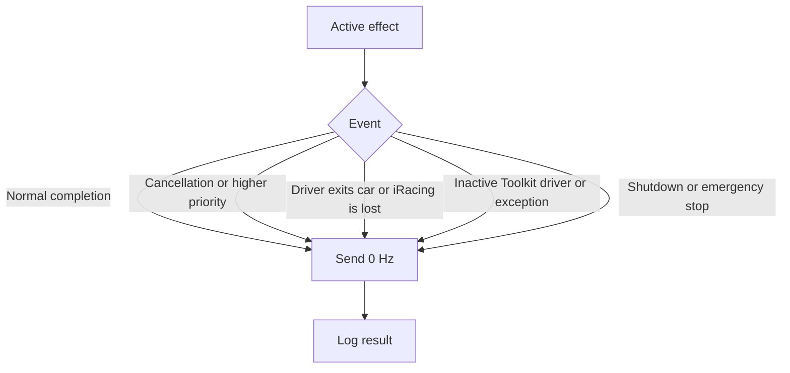

# Architecture

## Layers

### Core

- `TelemetrySignalProcessor`: fast/slow EMA, deltas, jerk and context;
- `ImpactDetector`: collisions, direction, severity and rollover;
- `VerticalImpactDetector`: kerbs, wheel drops, landings and compression;
- `IncidentDetector`: exact point deltas and best-effort type classification;
- `HapticDetectionPipeline`: runs all detectors and selects by priority;
- `HapticEventPolicy`: decides whether a detected category may produce rumble;
- `RumbleEffectMapper`: converts events into pulse patterns;
- `RumbleController`: serialization, preemption, cancellation, limits and OFF;
- `SettingsService`, `ProfileCatalog`, `ProfileRuleMatcher`,
  `RotatingFileLogger`;
- `TelemetryRecorder`, `TelemetryReplayClient`, `CalibrationAnalyzer`;
- `TelemetrySimulator` and `SimulatedRumbleDevice`.

### Infrastructure

- `Psvr2ToolkitClient`: discovery, DLL loading, exports, state and native calls;
- `IRacingSharedMemoryClient`: shared memory, reconnection, `SessionInfo` and
  normalization;
- `IRacingSessionInfoParser`: dependency-free extraction of player-car and
  circuit identity.

### App

- `AppCoordinator`: application lifecycle and integration, with no detector
  logic in the UI;
- `MainForm`: English WinForms interface.

## Data flow

Category switches are deliberately applied after detection. This allows the
Diagnostics tab and JSONL calibration to observe an event without sending
rumble to the headset.

## Profile flow

Rules are deterministic: priority, specificity, then rule name. A profile owns
detector settings, category switches, incident policy and effect patterns. The
real/simulated device choice, global haptics switch and safety limits remain
outside profiles. A profile change resets detector history and stops any active
effect so samples from two calibrations cannot be mixed.

`SessionInfo` changes slowly and is parsed only when its SDK update counter
changes. Fast telemetry rows continue to use the dynamic variable-header index.

## Incident flow

The signal processor compares successive non-null
`PlayerCarMyIncidentCount` values. It never generates a delta on initial
connection, driver entry, reset or a counter decrease. A positive delta becomes
1x, 2x, 4x or other. `IncidentDetector` retains a bounded evidence queue and
classifies the likely type from:

- `PlayerTrackSurface`;
- recent physical detector candidates;
- collision score;
- angular rate, roll and pitch.

The point value is SDK data; the type is an inference. Policy then applies the
point gate, type gate and duplicate protection. Mapping selects either the
point waveform or the type waveform according to the active profile.

## Failure and OFF flow

A native timeout is special: managed code cannot safely terminate a C function
that is stuck. After a timeout, the client blocks new commands and keeps the
DLL loaded until process exit instead of unloading it beneath a potentially
active native function.

## Extension points

New rumble devices implement `IHmdRumbleDevice`; new telemetry sources
implement `ITelemetryClient`. A new detector should emit
`DetectedHapticEvent`, register a post-detection policy switch, add a mapper
pattern and include simulator plus safety tests. See `CONTRIBUTING.md` for the
required checklist.
