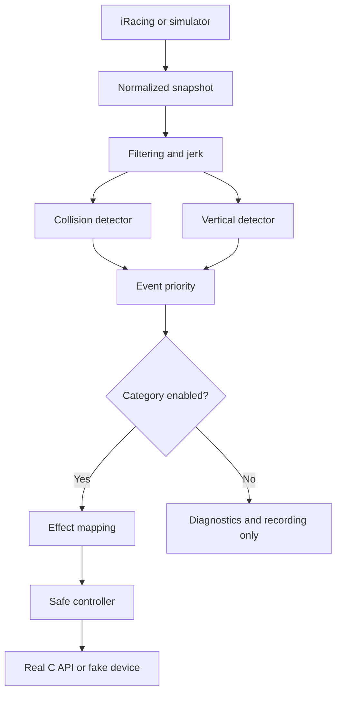
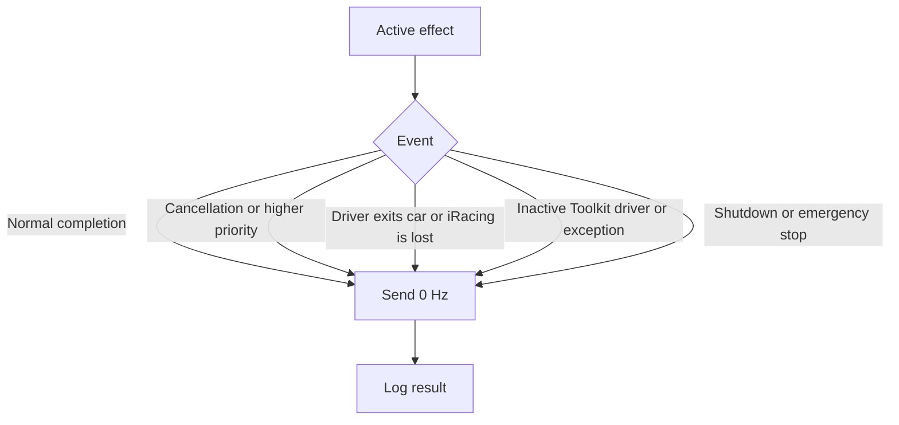

# Architecture

## Layers

### Core

- `TelemetrySignalProcessor`: fast/slow EMA, deltas, jerk and context;
- `ImpactDetector`: collisions, direction, severity and rollover;
- `VerticalImpactDetector`: kerbs, wheel drops, landings and compression;
- `HapticDetectionPipeline`: runs both detectors and selects by priority;
- `HapticEventPolicy`: decides whether a detected category may produce rumble;
- `RumbleEffectMapper`: converts events into pulse patterns;
- `RumbleController`: serialization, preemption, cancellation, limits and OFF;
- `SettingsService`, `ProfileCatalog`, `RotatingFileLogger`;
- `TelemetryRecorder`, `TelemetryReplayClient`, `CalibrationAnalyzer`;
- `TelemetrySimulator` and `SimulatedRumbleDevice`.

### Infrastructure

- `Psvr2ToolkitClient`: discovery, DLL loading, exports, state and native calls;
- `IRacingSharedMemoryClient`: shared memory, reconnection and normalization.

### App

- `AppCoordinator`: application lifecycle and integration, with no detector
  logic in the UI;
- `MainForm`: English WinForms interface.

## Data flow

Category switches are deliberately applied after detection. This allows the
Diagnostics tab and JSONL calibration to observe an event without sending
rumble to the headset.

## Failure and OFF flow

A native timeout is special: managed code cannot safely terminate a C function
that is stuck. After a timeout, the client blocks new commands and keeps the
DLL loaded until process exit instead of unloading it beneath a potentially
active native function.

## Future extensions

`AppSettings` separates profiles, detectors, event output, effects and safety.
A future version can associate a profile with session/car/track metadata
without changing the detectors or controller. New rumble devices implement
`IHmdRumbleDevice`; new telemetry sources implement `ITelemetryClient`.
